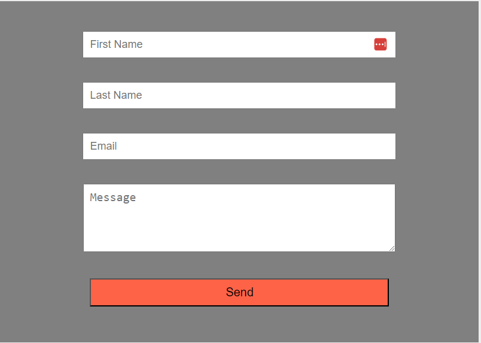
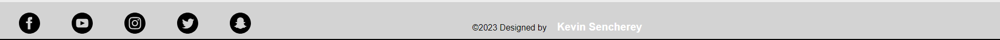

# Landing Page Project

 A landing page for **edX front end software development bootcamp**.
 This is week one assignment: Designing and build a simple landing page using HTML and style it using CSS.

## Description

Here is a short overview of the project

### What the project does

This is a simple landing page which users can make enquiry about the ongoing edX Front end development bootcamp. Users can fill out a `contact form` and submit a message for review.
The page has a fixed `navigation bar` with menu which links to the social media links in the `footer` and a contact menu which directs user straight to the contact form to submit and enquiry

### Technologies Used

HTML - `Hyper Text Markup Language`  was used to display the structure of the content of the landing page project in a browser

CSS - `Cascading Style Sheets` was used to style of the HTML content of the page.

### Features to implement later

A chat box so user can receive automated responses to frequently asked question and also get connected to a customer care agent for assistance in addressing any other question and/or concerns.

### How to access the landing page

To access the landing page project, click on the link below

[Landing page project](https://ksencherey.github.io/landing-page-project/)

### Credit

Husman Ahmed  - *Front end Development bootcamp Instructor*
